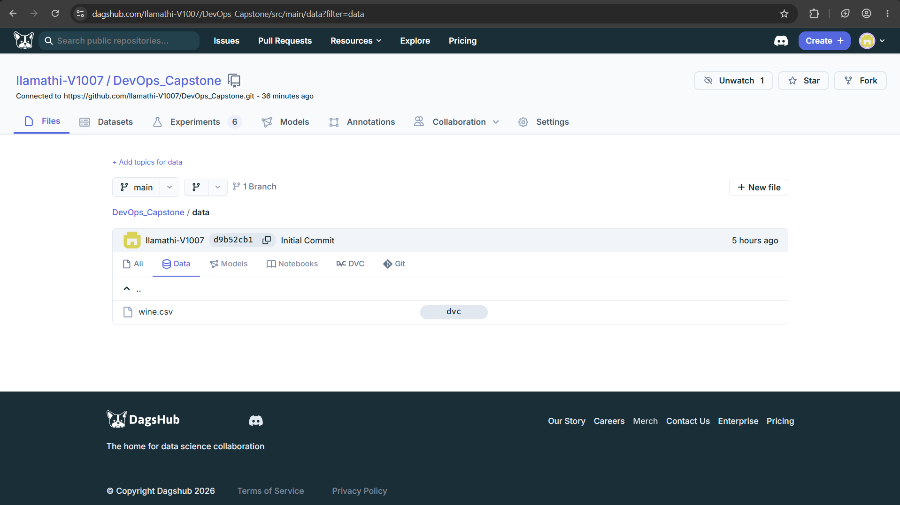
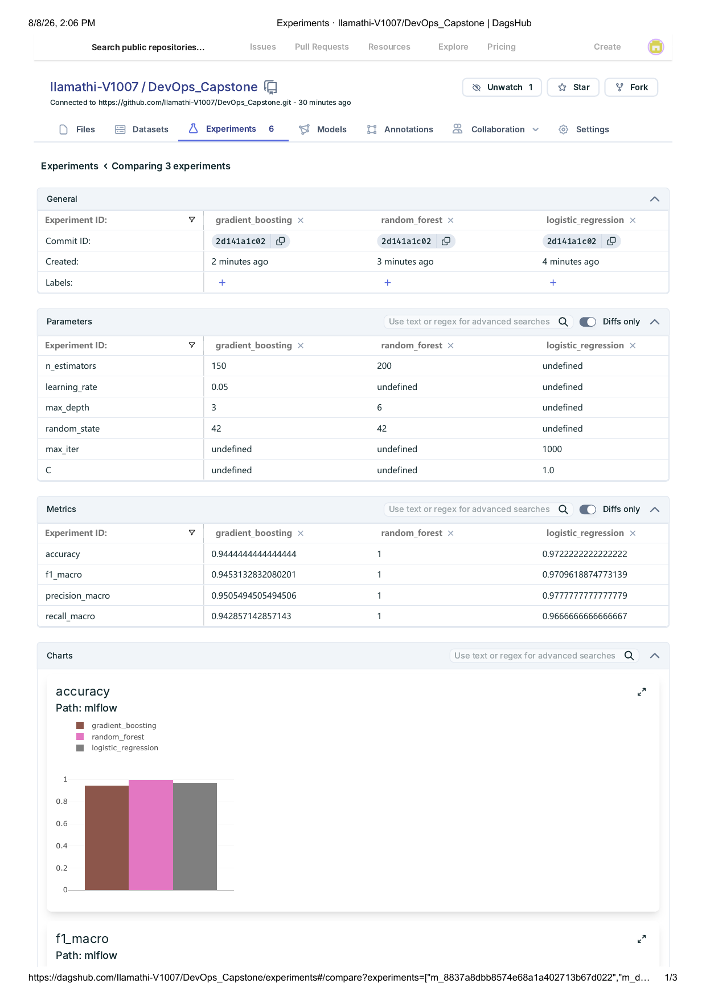
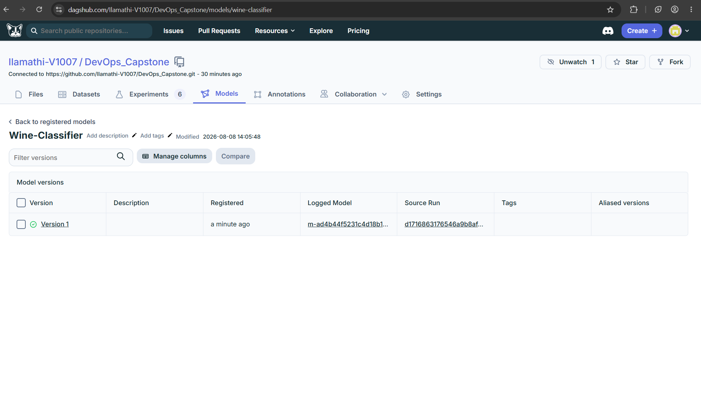
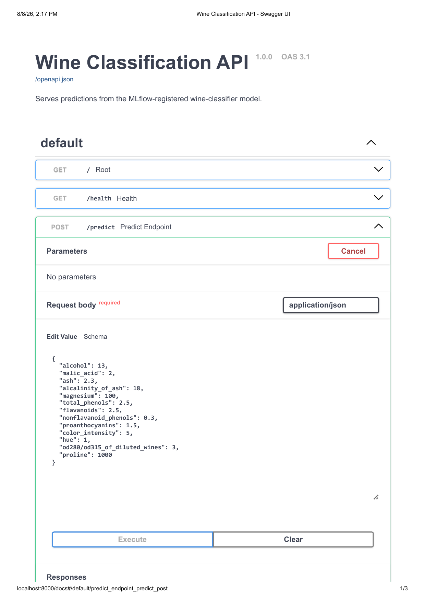
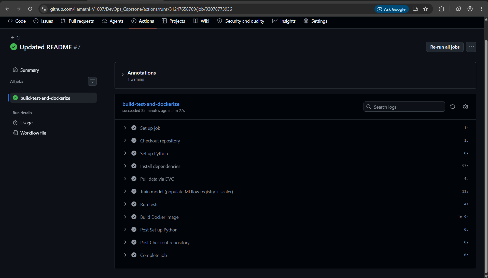

# MLOps Capstone: Wine Classification Pipeline

An end-to-end MLOps pipeline covering every stage from raw data to a
containerized, CI/CD-deployed prediction service:

```
Dataset → DVC Versioning → Training Script → MLflow Tracking → Best Model
→ Model Registry → FastAPI Prediction API → Docker Container
→ GitHub Repository → GitHub Actions (Build → Test → Docker Build)
```

**Dataset:** Wine classification dataset (178 samples, 13 features, 3 classes) —
a structured, publicly available dataset suitable for a classification problem.

**Live repo:** [github.com/Ilamathi-V1007/DevOps_Capstone](https://github.com/Ilamathi-V1007/DevOps_Capstone)
**DVC + MLflow remote:** [dagshub.com/Ilamathi-V1007/DevOps_Capstone](https://dagshub.com/Ilamathi-V1007/DevOps_Capstone)

---

## Project Structure

```
project/
├── data/                   # Dataset, versioned with DVC
├── models/                 # Saved preprocessing scaler (model artifact lives in the MLflow registry)
├── src/
│   ├── train.py             # Data loading, preprocessing, 3-model training, MLflow tracking
│   ├── app.py                # FastAPI app exposing POST /predict
│   ├── predict.py            # Loads registered model + scaler, runs inference
│   └── utils.py
├── tests/                  # pytest suite for the API and training pipeline
├── .github/
│   └── workflows/
│       └── ci.yml            # GitHub Actions: checkout → deps → DVC pull → train → test → docker build
├── Dockerfile
├── requirements.txt
├── dvc.yaml
├── .gitignore
└── README.md
```

---

## 1. Dataset Selection

Structured classification dataset: Wine classification (`sklearn.datasets.load_wine`),
178 samples, 13 numeric features, 3 target classes. Saved as `data/wine.csv`.

## 2. Data Versioning with DVC

The dataset is tracked with DVC, integrated with Git: Git holds the lightweight
`.dvc` pointer file and `dvc.yaml` pipeline definition, while the actual data
lives in a DVC remote hosted on **DagsHub**.



### One-time local setup

```bash
dvc init
dvc add data/wine.csv
git add data/wine.csv.dvc data/.gitignore

dvc remote add -d origin https://dagshub.com/Ilamathi-V1007/DevOps_Capstone.dvc
dvc remote modify origin --local auth basic
dvc remote modify origin --local user <your-dagshub-username>
dvc remote modify origin --local password <your-dagshub-token>

dvc push
git add .dvc/config
git commit -m "Configure DVC remote and track dataset"
git push
```

### Pulling the data (fresh clone, or in CI)

```bash
dvc pull
```

## 3. Machine Learning Pipeline

`src/train.py` runs the full pipeline:

- **Data loading** — reads `data/wine.csv`
- **Preprocessing** — `StandardScaler`, fit on train split, saved to `models/scaler.joblib` for reuse at inference time
- **Model training** — trains **three** models and compares them:
  - Logistic Regression
  - Random Forest
  - Gradient Boosting
- **Model evaluation** — accuracy, macro F1, macro precision, macro recall on a held-out test split

```bash
set MLFLOW_TRACKING_URI=https://dagshub.com/Ilamathi-V1007/DevOps_Capstone.mlflow
set MLFLOW_TRACKING_USERNAME=<your-dagshub-username>
set MLFLOW_TRACKING_PASSWORD=<your-dagshub-token>
python src/train.py
```

## 4. MLflow Experiment Tracking

Every run logs:
- **Parameters** — hyperparameters for each model
- **Metrics** — accuracy, F1, precision, recall
- **Model artifact** — the fitted scikit-learn model

Tracking is hosted on DagsHub's built-in MLflow server. The script automatically
compares all three runs by macro F1 and **registers the best-performing model**
(Random Forest, F1 = 1.0) as `Wine-Classifier` in the Model Registry.





## 5. Prediction API

`src/app.py` (FastAPI) loads the latest registered model from the MLflow
Model Registry at startup and exposes:

```
POST /predict
```

Run locally:

```bash
set MLFLOW_TRACKING_URI=https://dagshub.com/Ilamathi-V1007/DevOps_Capstone.mlflow
set MLFLOW_TRACKING_USERNAME=<your-dagshub-username>
set MLFLOW_TRACKING_PASSWORD=<your-dagshub-token>
uvicorn src.app:app --host 0.0.0.0 --port 8000 --reload
```

Interactive docs: `http://localhost:8000/docs`



Example request:

```bash
curl -X POST http://localhost:8000/predict -H "Content-Type: application/json" -d '{
  "alcohol": 13.0, "malic_acid": 2.0, "ash": 2.3, "alcalinity_of_ash": 18.0,
  "magnesium": 100.0, "total_phenols": 2.5, "flavanoids": 2.5,
  "nonflavanoid_phenols": 0.3, "proanthocyanins": 1.5, "color_intensity": 5.0,
  "hue": 1.0, "od280/od315_of_diluted_wines": 3.0, "proline": 1000.0
}'
```

## 6. Docker Containerization

`Dockerfile` packages:
- The FastAPI application (`src/`)
- Required dependencies (`requirements.txt`)
- The registered model (MLflow store) and preprocessing scaler (`models/`)
- Startup configuration (`uvicorn` entrypoint)

```bash
docker build -t wine-classifier-api .
docker run -p 8000:8000 wine-classifier-api
```

Visit `http://localhost:8000/docs` to confirm it's running inside the container.

## 7. GitHub Actions (CI/CD)

`.github/workflows/ci.yml` runs automatically on every push:

1. **Checkout** the repository
2. **Set up Python** environment (3.12)
3. **Install dependencies** (`requirements.txt`)
4. **Pull the dataset via DVC** — authenticates to the DagsHub remote using
   `DAGSHUB_USERNAME` / `DAGSHUB_TOKEN` GitHub Actions secrets, then `dvc pull`
5. **Train the model** — regenerates the MLflow registry entry + scaler
6. **Run tests** (`pytest tests/`)
7. **Build the Docker image**



### Required GitHub secrets

Set these under **Settings → Secrets and variables → Actions**:

| Secret | Value |
|---|---|
| `DAGSHUB_USERNAME` | Your DagsHub username |
| `DAGSHUB_TOKEN` | A DagsHub access token (Settings → Tokens) |

## 8. Tests

```bash
set MLFLOW_TRACKING_URI=https://dagshub.com/Ilamathi-V1007/DevOps_Capstone.mlflow
pytest tests/ -v
```

Covers: API health/root endpoints, `/predict` returning a valid class and
normalized probabilities, validation errors on malformed input, and the
training pipeline's data loading, preprocessing, and evaluation functions.

---

## Submission Checklist

- [x] GitHub Repository link — https://github.com/Ilamathi-V1007/DevOps_Capstone
- [x] Screenshot: MLflow experiment comparison (all 3 model runs)
- [x] Screenshot: registered model in the MLflow Model Registry
- [x] Screenshot: successful DVC tracking (DagsHub data view)
- [x] Screenshot: successful GitHub Actions workflow run
- [x] Screenshot: FastAPI prediction endpoint working (Swagger UI)
